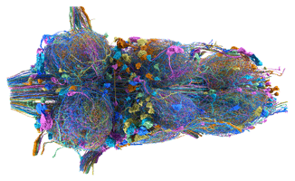

# malevnc



<!-- badges: start -->
[](https://github.com/natverse/malevnc/actions)
[](https://natverse.github.io/malevnc/reference/)
<!-- badges: end -->

The malevnc package provides a convenient natverse/neuprintr approach to 
analysing the Drosophila Male Adult Nerve Cord dataset (aka MANC). You can read
more about the MANC dataset and find links to a range of data and tools at https://www.janelia.org/project-team/flyem/manc-connectome.

## Installation

You can install the development version of malevnc from github:

``` r
install.packages("natmanager")
natmanager::install(pkgs="malevnc")
```
## Usage

### Dataset options
The package currently supports two distinct use cases / datasets

1. Access to the stable `MANC` connectome release for all general users
2. Access to an in progress `VNC` release for [flyconnectome](https://flyconnecto.me) and collaborators who need to update annotations etc.

Case 1 is now the default. If you usually need the second option then you must set

```r
options(malevnc.dataset='VNC')
```

in your `.Rprofile` e.g. by doing

```r
usethis::edit_r_profile()
```

You can also make a temporary change in the middle of a session by doing one of:

```r
malevnc:::choose_malevnc_dataset('VNC')
malevnc:::choose_malevnc_dataset('MANC')
```

The `malevnc:::` prefix is required because `choose_malevnc_dataset()` is 
currently a private function.

### Authentication - Neuprint

Access to neuprint requires authentication. 
See https://github.com/natverse/neuprintr#authentication for details.

The recommendation is to set
the `neuprint_token` environment variable, which is available after logging in
to the neuprint website. 

### Authentication - Clio

You only need to authenticate to the Clio API if you are interacting with the
in progress pre-release dataset (`VNC`).
You do this via a Google OAuth "dance" in your web browser. 
Note that the Clio and neuprint tokens look similar, but are *not* the same.
Note also that the neuprint token appears to be indefinite while the Clio token
currently lasts 3 weeks.

### Registrations

Running the symmetrising/bridging registrations currently depends on CMTK.
To use these you will need a CMTK installation.

* For MacOS X use the dmg from https://www.nitrc.org/projects/cmtk/
* For windows, I recommend Cygwin install. See https://natverse.org/nat/articles/Installation.html#cmtk-nat-on-windows for details.
* For Linux I recommend compiling or using [neurodebian](http://neuro.debian.net/pkgs/cmtk.html).

Check that the natverse has found CMTK like so:

```r
nat::cmtk.bindir()
nat::cmtk.dof2mat(version = T)
```

## Quick start

You can check everything is working like so:

``` r
library(nat)
library(malevnc)
plot3d(MANC.surf)

dnmeta=manc_neuprint_meta("class:descending")
dnmeta
```

To find out more, a quick tour round the [documentation website](https://natverse.org/malevnc/)

## Acknowledgements

We hope you find this package useful. If so, please can we trouble you for some
citations. This is important to justify the funding for connectome generation 
and especially for continued development of the natverse and related tools:

**For the natverse and this package**:

Alexander Shakeel Bates, James D Manton, Sridhar R Jagannathan, Marta Costa, Philipp Schlegel, Torsten Rohlfing, Gregory SXE Jefferis (2020) The natverse, a versatile toolbox for combining and analysing neuroanatomical data eLife 9:e53350 https://doi.org/10.7554/eLife.53350

**For the MANC connectome (neuron morphologies, connectivity etc)**:

*A Connectome of the Male Drosophila Ventral Nerve Cord.*
Shin-ya Takemura, Kenneth J Hayworth, Gary B Huang, Michal Januszewski, Zhiyuan Lu, Elizabeth C Marin, Stephan Preibisch, C Shan Xu, John Bogovic, Andrew S Champion, Han S J Cheong, Marta Costa, Katharina Eichler, William Katz, Christopher Knecht, Feng Li, Billy J Morris, Christopher Ordish, Patricia K Rivlin, Philipp Schlegel, Kazunori Shinomiya, Tomke Sturner, Ting Zhao, Griffin Badalamente, Dennis Bailey, Paul Brooks, Brandon S Canino, Jody Clements, Michael Cook, Octave Duclos, Christopher R Dunne, Kelli Fairbanks, Siqi Fang, Samantha Finley-May, Audrey Francis, Reed George, Marina Gkantia, Kyle Harrington, Gary Patrick Hopkins, Joseph Hsu, Philip M Hubbard, Alexandre Javier, Dagmar Kainmueller, Wyatt Korff, Julie Kovalyak, Dominik Krzeminski, Shirley A Lauchie, Alanna Lohff, Charli Maldonado, Emily A Manley, Caroline Mooney, Erika Neace, Matthew Nichols, Omotara Ogundeyi, Nneoma Okeoma, Tyler Paterson, Elliott Phillips, Emily M Phillips, Caitlin Ribeiro, Sean M Ryan, Jon Thomson Rymer, Anne K Scott, Ashley L Scott, David Shepherd, Aya Shinomiya, Claire Smith, Natalie Smith, Alia Suleiman, Satoko Takemura, Iris Talebi, Imaan F M Tamimi, Eric T Trautman, Lowell Umayam, John J Walsh, Tansy Yang, Gerald M Rubin, Louis K Scheffer, Jan Funke, Stephan Saalfeld, Harald F Hess, Stephen M Plaza, Gwyneth M Card, Gregory S X E Jefferis, Stuart Berg
bioRxiv 2023.06.05.543757; doi: https://doi.org/10.1101/2023.06.05.543757

**For general annotations of the MANC connectome (cell classes, types etc)**:

*Systematic annotation of a complete adult male Drosophila nerve cord connectome reveals principles of functional organisation*
Elizabeth C Marin, Billy J Morris, Tomke Stuerner, Andrew S Champion, Dominik Krzeminski, Griffin Badalamente, Marina Gkantia, Christopher R Dunne, Katharina Eichler, Shin-ya Takemura, Imaan F M Tamimi, Siqi Fang, Sung Soo Moon, Han S J Cheong, Feng Li, Philipp Schlegel, Stuart Berg, FlyEM Project Team, Gwyneth M Card, Marta Costa, David Shepherd, Gregory S X E Jefferis
bioRxiv 2023.06.05.543407; doi: https://doi.org/10.1101/2023.06.05.543407

**For descending neuron or motor neuron cell types**:

*Transforming descending input into behavior: The organization of premotor circuits in the Drosophila Male Adult Nerve Cord connectome*
Han S J Cheong, Katharina Eichler, Tomke Stuerner, Samuel K Asinof, Andrew S Champion, Elizabeth C Marin, Tess B Oram, Marissa Sumathipala, Lalanti Venkatasubramanian, Shigehiro Namiki, Igor Siwanowicz, Marta Costa, Stuart Berg, Janelia FlyEM Project Team, Gregory S X E Jefferis, Gwyneth M Card
bioRxiv 2023.06.07.543976; doi: https://doi.org/10.1101/2023.06.07.543976
